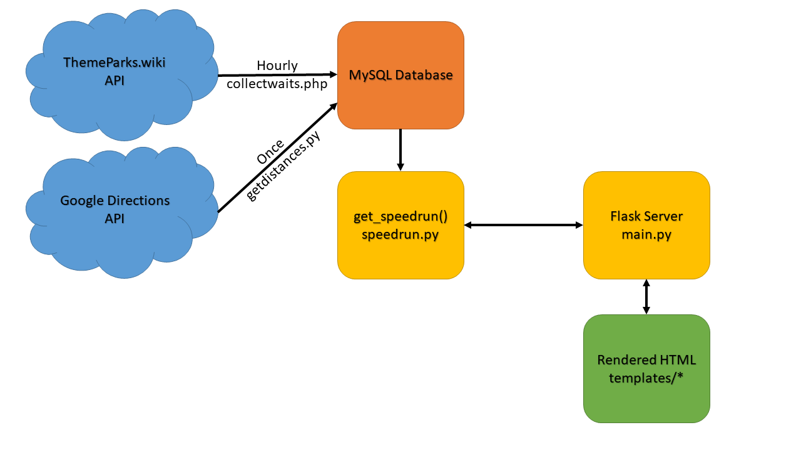
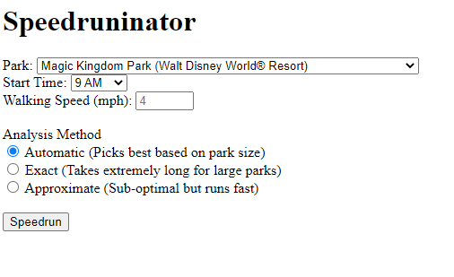
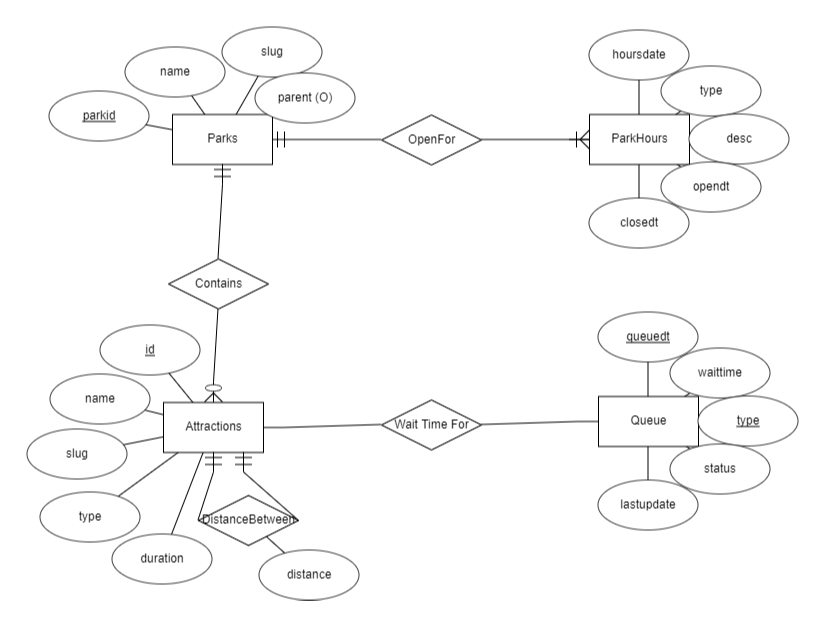
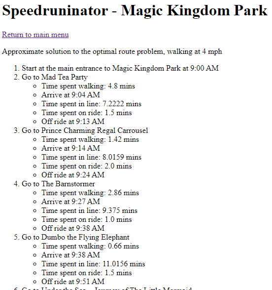
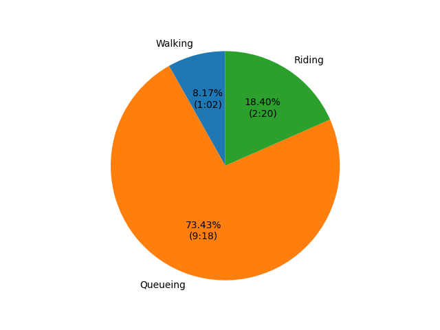

# The Speedruninator
## Overview
 
The Speedruninator is a program which identifies the optimal route to experience every ride at various Disney theme parks in a minimum amount of time. This is done using historical wait times, the distance between rides, and the duration of those rides.

The application is primarily written in Python using a Flask server to facilitate user interaction. Data is collected from two APIs and stored in a MySQL database. When a request is made to calculate a speedrun, the Flask server calls an included Python function to get the optimal route. This function pulls information from the MySQL database and calculates the optimal route. This route is returned to the Flask server as a dictionary, which then uses Jinja to populate an HTML template to create a user-friendly output of the route. 



## Implementation Details

A web form is presented to the user which allows them to select which park they would like to speedrun, what time they'd like to start, which search method they'd like to use (more on that later), and how fast they walk. 

  

Then, a Python script interprets the input options before providing all the required information to the main function of this project, get_speedrun() (located in [speedrun.py](speedrun.py)). This executes one of two methods to obtain a route: exact or approximate. The reasoning for this is that the problem of finding the optimal route through all rides with varying wait times is a modified version of the [Travelling Salesman Problem](https://en.wikipedia.org/wiki/Travelling_salesman_problem), which is np-hard. In other words, with a large enough number of "cities" (or rides) to visit, it can take a prohibitively long time to come up with an exact solution. Through testing, it has been determined that the exact solution terminates in a reasonable amount of time (roughly 5-10 seconds on my laptop) for parks with less than 15 rides. Fortunately, most of the parks covered have less than 15 attractions that are considered "rides". For the sake of this project, the solution only visits entities with type "ATTRACTION" as defined by the [ThemeParks.wiki API](https://themeparks.wiki) (using v1), which excludes live shows, character meet & greets, and films. This is because the excluded attractions' wait times are often dictated by the duration of the attraction due to large batch sizes and the fact that many of those attractions can fit the entire queue into a single batch. For parks with more than 15 attractions, an approximate solution is found.
- The exact method implements a "branch and bound" solution, which searches every possible path through the park. As you might expect, this is very time consuming, so a bound is applied to the search based on the current best route and the value of a heuristic function as calculated on the current partial route. For this project, the heuristic function is the sum of the durations of all rides not yet ridden. If the amount of time spent on a given route so far plus the amount of time it would take to ride all remaining rides, assuming you could teleport from one ride to the next and skip all lines, is greater than the amount of time required to complete the current best known route, then the current partial route is abandoned and a new partial route is selected.
- The approximate method starts off with a greedy algorithm which creates a route by always picking the fastest ride to complete (ie, walk to, wait in line for, and ride) from the list of rides not yet ridden. This provides a solution which is likely not optimal, but is at least on the right track. It also provides a complete route in a very short amount of time. Then, 2- and 3-opt moves are performed on all stages of the route, modifying the route until no modifications yield a faster route. These 2- and 3-opt moves re-arrange the order in which rides are ridden by swapping fragments of a route to create a new route which potentially is faster. This process continues until no moves produce a faster route, at which point the algorithm has found a local minimum. When testing this algorithm against the exact solution, results within 12.5% of the exact solution were found.

To simulate how long a day at a Disney park would take, three sources of time were considered: walking time, queueing time, and riding time.
- Walking time is obtained through a combination of sources. First, the latitude and longitude of each attraction is obtained from the [ThemeParks.wiki API](https://themeparks.wiki). Then, the actual distance required to walk from one attraction to the next (while following all pathways) is obtained from the Google Directions API. Since Google has mapped out pathways in the Disney parks, the returned distance in meters is roughly equivalent to the actual distance required to walk from one ride to the next. To avoid continually pinging the Directions API, the distance (in meters) between all pairs of rides within the same park is saved to a database table. Then, when the walking time is requested, that distance is simply divided by the provided walking speed (after converting to meters per minute) to provide the estimated walking time in minutes. To help speed up the script, all walking distances are retrieved, converted to times, and stored in a matrix which can be indexed quickly by the Python script.
- For queue time information, data is collected hourly by a cron job running on a server running PHP. The script being executed is [collectwaits.php](collectwaits.php), which pulls wait time information for all rides in all Disney parks from the [ThemeParks.wiki API](https://themeparks.wiki) and stores it in a database (structure shown below).

  
  
  To obtain the expected wait for a ride, the hour at which the guest is expected to arrive at the ride is obtained. Then, the average wait time for that attraction at that hour across all days recorded in the dataset is returned as the anticipated wait time for that ride. In the interest of removing SQL queries, all wait times for all attractions in the given park are selected at the start of the function and stored in an `Nx24` matrix, where `N` is the number of rides in the park and 24 is the number of hours in a day.
- The duration of a ride is constant, so the value is stored in the database and queried on script start.

Once the function has determined a route, it returns both the route and information on all rides in a pair of objects with the following format:
```
[
  attractions = [
    attraction = {
      id, name, slug, type, dur, lat, lon
    }
  ],
  bestroute = {
    path = [id1, id2, ..., idN],
    cost = int,
    times = [
      {
        distance, wait, time
      }
    ]
  }
]
```

These objects are used by the Flask server to generate a reasonably user friendly front end, outlining the route that has been generated. A Google Directions-style step-by-step ordered list of rides (along with time estimates) is provided to the user.



Matplotlib is used to generate a pie chart illustrating the amount of time spent in the parks, broken down into walking, queueing, and riding. While the chart itself looks nice, the information it portrays is often quite dissappointing.



Finally, an animated GIF is also generated which draws your route over a top-down satellite view of the park. While it doesn't follow the pathways like an actual Google Directions might, it makes it very easy to see how much the chosen route respects physical distance between rides. Often times, the distance is not the major factor (as illustrated by the pie chart), so some routes zig-zag across the park. As you may expect, decreasing the walking speed can actually cause the algorithm to be smarter about how it moves around the park, even if it means waiting longer for certain popular rides.


## Results

As a result, with all of the current information about wait times, it would take approximately 12.5 hours to ride all the rides in the Magic Kingdom, walking at 4mph and starting at 9am. As pointed out by the pie chart, of your 12.5 hour day, about 9.3 hours would be spent waiting in line and 1 hour would be spent walking from one ride to the next, leaving just 2.3 hours to actually ride the rides in the park. There's a lot of factors that aren't being considered here, such as how often you would need to stop for food or restroom breaks, day-to-day variance in park attendance (such as weather or weekends vs weekdays), or alternative ways to wait in a line for a ride, such as the single rider line or the FastPass system. However, I believe that the factors that are being accounted for create a reasonable simulation for a day at Disney, espcially since you *theoretically* could ignore food or bathroom breaks, especially for the smaller parks which take around 4 hours. Besides, the FastPass system alone is [ridiculously complex to simulate](https://youtu.be/9yjZpBq1XBE?t=3433).

## APIs Used

Two APIs were used for this project: the Google Directions API and the [ThemeParks.wiki API](https://themeparks.wiki).
- The Directions API was used to get an accurate walking distance between each pair of rides in each Disney park. Each call to the API consisted of a pair of locations represented by their latitude and longitude, as well as an indication that I was looking for walking directions (as opposed to driving, public transit, etc.). The only data collected from the result was the distance (in meters) from the start to the end. To cut down on the number of API calls (since this is a paid API), it is assumed that the distance from A to B is the same as the distance from B to A.
- The ThemeParks.wiki API provides a plethora of information about the Disney parks and attractions. A vast majority of the information was collected from this API. Each park is outlined by its name, location, and parent destination (ex, The Magic Kingdom's parent destination is Walt Disney World in Orlando, FL), and information about the park hours is also included. Each attraction has information about the ride name, geographic location as lat/lon, current operating status (operating, down, closed, etc), and current wait times for all available queue lines (ie, standby, single rider). The only information about the attractions not collected from this API is the duration of the attraction, which was manually appended to the attractions' entries in the MySQL database based on information obtained from Wikipedia.
